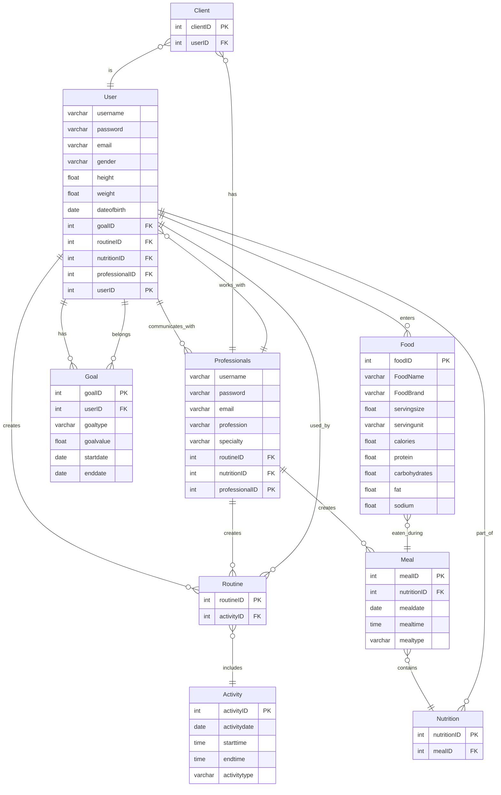

#1.Create an Entity Relationship Diagram

#2.Create an API in Python using FastAPI (we'll switch to Django later)

#3.Create Pydantic models that mirror your ERD and assist to validate Create, Read, Update, Delete (CRUD) apps for your ERD

#4.Develop an initial set of CRUD transactions that would begin to develop and use the entities from your domain. We are not implementing any meaningful logic right now, just simply performaing basic state (CRUD) operations

