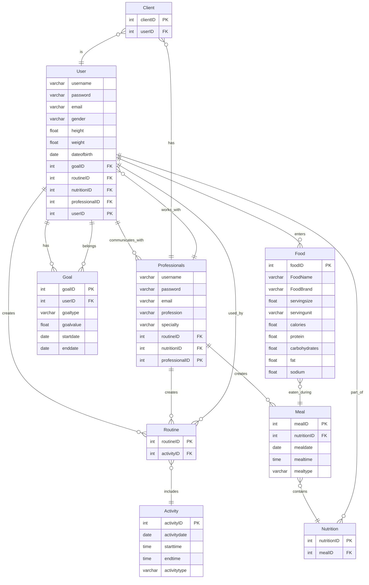

1.Create an Entity Relationship Diagram

2.Create an API in Python using FastAPI (we'll switch to Django later)

from typing import List, Optional
from datetime import date, time

from fastapi import FastAPI, HTTPException
from pydantic import BaseModel

app = FastAPI()

### --- Data Models ---

class UserBase(BaseModel):
    username: str
    password: str
    email: str
    gender: str
    height: float
    weight: float
    dateofbirth: date

class UserCreate(UserBase):
    goalID: Optional[int] = None  # Allow creation without immediate goal assignment
    routineID: Optional[int] = None
    nutritionID: Optional[int] = None
    professionalID: Optional[int] = None

class User(UserBase):
    userID: int
    goalID: Optional[int] = None
    routineID: Optional[int] = None
    nutritionID: Optional[int] = None
    professionalID: Optional[int] = None

    class Config:
        orm_mode = True # Enable ORM mode for automatic conversion

class ProfessionalBase(BaseModel):
    username: str
    password: str
    email: str
    profession: str
    specialty: str

class ProfessionalCreate(ProfessionalBase):
    routineID: Optional[int] = None
    nutritionID: Optional[int] = None

class Professional(ProfessionalBase):
    professionalID: int
    routineID: Optional[int] = None
    nutritionID: Optional[int] = None

    class Config:
        orm_mode = True

class GoalBase(BaseModel):
    userID: int
    goaltype: str
    goalvalue: float
    startdate: date
    enddate: date

class GoalCreate(GoalBase):
    pass

class Goal(GoalBase):
    goalID: int

    class Config:
        orm_mode = True

class ActivityBase(BaseModel):
    activitydate: date
    starttime: time
    endtime: time
    activitytype: str

class ActivityCreate(ActivityBase):
    pass

class Activity(ActivityBase):
    activityID: int

    class Config:
        orm_mode = True

class RoutineBase(BaseModel):
    activityID: int

class RoutineCreate(RoutineBase):
    pass

class Routine(RoutineBase):
    routineID: int

    class Config:
        orm_mode = True

class FoodBase(BaseModel):
    FoodName: str
    FoodBrand: str
    servingsize: float
    servingunit: str
    calories: float
    protein: float
    carbohydrates: float
    fat: float
    sodium: float

class FoodCreate(FoodBase):
    pass

class Food(FoodBase):
    foodID: int

    class Config:
        orm_mode = True

class MealBase(BaseModel):
    nutritionID: int
    mealdate: date
    mealtime: time
    mealtype: str

class MealCreate(MealBase):
    pass

class Meal(MealBase):
    mealID: int

    class Config:
        orm_mode = True

class NutritionBase(BaseModel):
    pass

class NutritionCreate(NutritionBase):
    mealID: int

class Nutrition(NutritionBase):
    nutritionID: int
    mealID: int

    class Config:
        orm_mode = True

class ClientBase(BaseModel):
    userID: int

class ClientCreate(ClientBase):
    pass

class Client(ClientBase):
    clientID: int

    class Config:
        orm_mode = True

### --- Dummy Data (Replace with Database Integration) ---

users: List[User] = []
professionals: List[Professional] = []
goals: List[Goal] = []
activities: List[Activity] = []
routines: List[Routine] = []
foods: List[Food] = []
meals: List[Meal] = []
nutritions: List[Nutrition] = []
clients: List[Client] = []

user_id_counter = 1
professional_id_counter = 1
goal_id_counter = 1
activity_id_counter = 1
routine_id_counter = 1
food_id_counter = 1
meal_id_counter = 1
nutrition_id_counter = 1
client_id_counter = 1

### --- API Endpoints ---

# Users
@app.post("/users/", response_model=User, status_code=201)
def create_user(user: UserCreate):
    global user_id_counter
    new_user = User(**user.dict(), userID=user_id_counter)
    users.append(new_user)
    user_id_counter += 1
    return new_user

@app.get("/users/", response_model=List[User])
def read_users():
    return users

@app.get("/users/{user_id}", response_model=User)
def read_user(user_id: int):
    user = next((user for user in users if user.userID == user_id), None)
    if user is None:
        raise HTTPException(status_code=404, detail="User not found")
    return user

@app.put("/users/{user_id}", response_model=User)
def update_user(user_id: int, updated_user: UserCreate):
    global users
    user_index = next((i for i, user in enumerate(users) if user.userID == user_id), None)
    if user_index is None:
        raise HTTPException(status_code=404, detail="User not found")
    users[user_index] = User(**updated_user.dict(), userID=user_id) #Keep the original ID
    return users[user_index]

@app.delete("/users/{user_id}", status_code=204)
def delete_user(user_id: int):
    global users
    user_index = next((i for i, user in enumerate(users) if user.userID == user_id), None)
    if user_index is None:
        raise HTTPException(status_code=404, detail="User not found")
    del users[user_index]
    return

# Professionals
@app.post("/professionals/", response_model=Professional, status_code=201)
def create_professional(professional: ProfessionalCreate):
    global professional_id_counter
    new_professional = Professional(**professional.dict(), professionalID=professional_id_counter)
    professionals.append(new_professional)
    professional_id_counter += 1
    return new_professional

@app.get("/professionals/", response_model=List[Professional])
def read_professionals():
    return professionals

@app.get("/professionals/{professional_id}", response_model=Professional)
def read_professional(professional_id: int):
    professional = next((professional for professional in professionals if professional.professionalID == professional_id), None)
    if professional is None:
        raise HTTPException(status_code=404, detail="Professional not found")
    return professional

@app.put("/professionals/{professional_id}", response_model=Professional)
def update_professional(professional_id: int, updated_professional: ProfessionalCreate):
    global professionals
    professional_index = next((i for i, professional in enumerate(professionals) if professional.professionalID == professional_id), None)
    if professional_index is None:
        raise HTTPException(status_code=404, detail="Professional not found")
    professionals[professional_index] = Professional(**updated_professional.dict(), professionalID=professional_id) #Keep original ID
    return professionals[professional_index]

@app.delete("/professionals/{professional_id}", status_code=204)
def delete_professional(professional_id: int):
    global professionals
    professional_index = next((i for i, professional in enumerate(professionals) if professional.professionalID == professional_id), None)
    if professional_index is None:
        raise HTTPException(status_code=404, detail="Professional not found")
    del professionals[professional_index]
    return

### Goals
@app.post("/goals/", response_model=Goal, status_code=201)
def create_goal(goal: GoalCreate):
    global goal_id_counter
    new_goal = Goal(**goal.dict(), goalID=goal_id_counter)
    goals.append(new_goal)
    goal_id_counter += 1
    return new_goal

@app.get("/goals/", response_model=List[Goal])
def read_goals():
    return goals

@app.get("/goals/{goal_id}", response_model=Goal)
def read_goal(goal_id: int):
    goal = next((goal for goal in goals if goal.goalID == goal_id), None)
    if goal is None:
        raise HTTPException(status_code=404, detail="Goal not found")
    return goal

@app.put("/goals/{goal_id}", response_model=Goal)
def update_goal(goal_id: int, updated_goal: GoalCreate):
    global goals
    goal_index = next((i for i, goal in enumerate(goals) if goal.goalID == goal_id), None)
    if goal_index is None:
        raise HTTPException(status_code=404, detail="Goal not found")
    goals[goal_index] = Goal(**updated_goal.dict(), goalID=goal_id)
    return goals[goal_index]

@app.delete("/goals/{goal_id}", status_code=204)
def delete_goal(goal_id: int):
    global goals
    goal_index = next((i for i, goal in enumerate(goals) if goal.goalID == goal_id), None)
    if goal_index is None:
        raise HTTPException(status_code=404, detail="Goal not found")
    del goals[goal_index]
    return

### Activities
@app.post("/activities/", response_model=Activity, status_code=201)
def create_activity(activity: ActivityCreate):
    global activity_id_counter
    new_activity = Activity(**activity.dict(), activityID=activity_id_counter)
    activities.append(new_activity)
    activity_id_counter += 1
    return new_activity

@app.get("/activities/", response_model=List[Activity])
def read_activities():
    return activities

@app.get("/activities/{activity_id}", response_model=Activity)
def read_activity(activity_id: int):
    activity = next((activity for activity in activities if activity.activityID == activity_id), None)
    if activity is None:
        raise HTTPException(status_code=404, detail="Activity not found")
    return activity

@app.put("/activities/{activity_id}", response_model=Activity)
def update_activity(activity_id: int, updated_activity: ActivityCreate):
    global activities
    activity_index = next((i for i, activity in enumerate(activities) if activity.activityID == activity_id), None)
    if activity_index is None:
        raise HTTPException(status_code=404, detail="Activity not found")
    activities[activity_index] = Activity(**updated_activity.dict(), activityID=activity_id)
    return activities[activity_index]

@app.delete("/activities/{activity_id}", status_code=204)
def delete_activity(activity_id: int):
    global activities
    activity_index = next((i for i, activity in enumerate(activities) if activity.activityID == activity_id), None)
    if activity_index is None:
        raise HTTPException(status_code=404, detail="Activity not found")
    del activities[activity_index]
    return

### Routines
@app.post("/routines/", response_model=Routine, status_code=201)
def create_routine(routine: RoutineCreate):
    global routine_id_counter
    new_routine = Routine(**routine.dict(), routineID=routine_id_counter)
    routines.append(new_routine)
    routine_id_counter += 1
    return new_routine

@app.get("/routines/", response_model=List[Routine])
def read_routines():
    return routines

@app.get("/routines/{routine_id}", response_model=Routine)
def read_routine(routine_id: int):
    routine = next((routine for routine in routines if routine.routineID == routine_id), None)
    if routine is None:
        raise HTTPException(status_code=404, detail="Routine not found")
    return routine

@app.put("/routines/{routine_id}", response_model=Routine)
def update_routine(routine_id: int, updated_routine: RoutineCreate):
    global routines
    routine_index = next((i for i, routine in enumerate(routines) if routine.routineID == routine_id), None)
    if routine_index is None:
        raise HTTPException(status_code=404, detail="Routine not found")
    routines[routine_index] = Routine(**updated_routine.dict(), routineID=routine_id)
    return routines[routine_index]

@app.delete("/routines/{routine_id}", status_code=204)
def delete_routine(routine_id: int):
    global routines
    routine_index = next((i for i, routine in enumerate(routines) if routine.routineID == routine_id), None)
    if routine_index is None:
        raise HTTPException(status_code=404, detail="Routine not found")
    del routines[routine_index]
    return

### Foods
@app.post("/foods/", response_model=Food, status_code=201)
def create_food(food: FoodCreate):
    global food_id_counter
    new_food = Food(**food.dict(), foodID=food_id_counter)
    foods.append(new_food)
    food_id_counter += 1
    return new_food

@app.get("/foods/", response_model=List[Food])
def read_foods():
    return foods

@app.get("/foods/{food_id}", response_model=Food)
def read_food(food_id: int):
    food = next((food for food in foods if food.foodID == food_id), None)
    if food is None:
        raise HTTPException(status_code=404, detail="Food not found")
    return food

@app.put("/foods/{food_id}", response_model=Food)
def update_food(food_id: int, updated_food: FoodCreate):
    global foods
    food_index = next((i for i, food in enumerate(foods) if food.foodID == food_id), None)
    if food_index is None:
        raise HTTPException(status_code=404, detail="Food not found")
    foods[food_index] = Food(**updated_food.dict(), foodID=food_id)
    return foods[food_index]

@app.delete("/foods/{food_id}", status_code=204)
def delete_food(food_id: int):
    global foods
    food_index = next((i for i, food in enumerate(foods) if food.foodID == food_id), None)
    if food_index is None:
        raise HTTPException(status_code=404, detail="Food not found")
    del foods[food_index]
    return

### Meals
@app.post("/meals/", response_model=Meal, status_code=201)
def create_meal(meal: MealCreate):
    global meal_id_counter
    new_meal = Meal(**meal.dict(), mealID=meal_id_counter)
    meals.append(new_meal)
    meal_id_counter += 1
    return new_meal

@app.get("/meals/", response_model=List[Meal])
def read_meals():
    return meals

@app.get("/meals/{meal_id}", response_model=Meal)
def read_meal(meal_id: int):
    meal = next((meal for meal in meals if meal.mealID == meal_id), None)
    if meal is None:
        raise HTTPException(status_code=404, detail="Meal not found")
    return meal

@app.put("/meals/{meal_id}", response_model=Meal)
def update_meal(meal_id: int, updated_meal: MealCreate):
    global meals
    meal_index = next((i for i, meal in enumerate(meals) if meal.mealID == meal_id), None)
    if meal_index is None:
        raise HTTPException(status_code=404, detail="Meal not found")
    meals[meal_index] = Meal(**updated_meal.dict(), mealID=meal_id)
    return meals[meal_index]

@app.delete("/meals/{meal_id}", status_code=204)
def delete_meal(meal_id: int):
    global meals
    meal_index = next((i for i, meal in enumerate(meals) if meal.mealID == meal_id), None)
    if meal_index is None:
        raise HTTPException(status_code=404, detail="Meal not found")
    del meals[meal_index]
    return

### Nutritions
@app.post("/nutritions/", response_model=Nutrition, status_code=201)
def create_nutrition(nutrition: NutritionCreate):
    global nutrition_id_counter
    new_nutrition = Nutrition(**nutrition.dict(), nutritionID=nutrition_id_counter)
    nutritions.append(new_nutrition)
    nutrition_id_counter += 1
    return new_nutrition

@app.get("/nutritions/", response_model=List[Nutrition])
def read_nutritions():
    return nutritions

@app.get("/nutritions/{nutrition_id}", response_model=Nutrition)
def read_nutrition(nutrition_id: int):
    nutrition = next((nutrition for nutrition in nutritions if nutrition.nutritionID == nutrition_id), None)
    if nutrition is None:
        raise HTTPException(status_code=404, detail="Nutrition not found")
    return nutrition

@app.put("/nutritions/{nutrition_id}", response_model=Nutrition)
def update_nutrition(nutrition_id: int, updated_nutrition: NutritionCreate):
    global nutritions
    nutrition_index = next((i for i, nutrition in enumerate(nutritions) if nutrition.nutritionID == nutrition_id), None)
    if nutrition_index is None:
        raise HTTPException(status_code=404, detail="Nutrition not found")
    nutritions[nutrition_index] = Nutrition(**updated_nutrition.dict(), nutritionID=nutrition_id)
    return nutritions[nutrition_index]

@app.delete("/nutritions/{nutrition_id}", status_code=204)
def delete_nutrition(nutrition_id: int):
    global nutritions
    nutrition_index = next((i for i, nutrition in enumerate(nutritions) if nutrition.nutritionID == nutrition_id), None)
    if nutrition_index is None:
        raise HTTPException(status_code=404, detail="Nutrition not found")
    del nutritions[nutrition_index]
    return

### Clients
@app.post("/clients/", response_model=Client, status_code=201)
def create_client(client: ClientCreate):
    global client_id_counter
    new_client = Client(**client.dict(), clientID=client_id_counter)
    clients.append(new_client)
    client_id_counter += 1
    return new_client

@app.get("/clients/", response_model=List[Client])
def read_clients():
    return clients

@app.get("/clients/{client_id}", response_model=Client)
def read_client(client_id: int):
    client = next((client for client in clients if client.clientID == client_id), None)
    if client is None:
        raise HTTPException(status_code=404, detail="Client not found")
    return client

@app.put("/clients/{client_id}", response_model=Client)
def update_client(client_id: int, updated_client: ClientCreate):
    global clients
    client_index = next((i for i, client in enumerate(clients) if client.clientID == client_id), None)
    if client_index is None:
        raise HTTPException(status_code=404, detail="Client not found")
    clients[client_index] = Client(**updated_client.dict(), clientID=client_id)
    return clients[client_index]

@app.delete("/clients/{client_id}", status_code=204)
def delete_client(client_id: int):
    global clients
    client_index = next((i for i, client in enumerate(clients) if client.clientID == client_id), None)
    if client_index is None:
        raise HTTPException(status_code=404, detail="Client not found")
    del clients[client_index]
    return

### --- Database Integration (Placeholder) ---

#### In a real application, you would replace the dummy data with a database.
#### You would typically use an ORM like SQLAlchemy to interact with the database.
#### The data models would then be mapped to database tables.
#### You would also need to handle database connections, sessions, and transactions.

#### Example using SQLAlchemy:
#### from sqlalchemy import create_engine, Column, Integer, String, Float, Date, Time, ForeignKey
#### from sqlalchemy.orm import declarative_base, sessionmaker, relationship

#### DATABASE_URL = "sqlite:///./test.db"  # Replace with your database URL

#### engine = create_engine(DATABASE_URL)
#### SessionLocal = sessionmaker(autocommit=False, autoflush=False, bind=engine)

#### Base = declarative_base()

#### class UserDB(Base):
####    __tablename__ = "users"

####     userID = Column(Integer, primary_key=True, index=True)
####     username = Column(String)
####     password = Column(String)
####     email = Column(String)
####     gender = Column(String)
####     height = Column(Float)
####     weight = Column(Float)
####     dateofbirth = Column(Date)
####     goalID = Column(Integer, ForeignKey("goals.goalID"))
####     routineID = Column(Integer, ForeignKey("routines.routineID"))
####     nutritionID = Column(Integer, ForeignKey("nutritions.nutritionID"))
####     professionalID = Column(Integer, ForeignKey("professionals.professionalID"))

####     goals = relationship("GoalDB", back_populates="user")
####     routines = relationship("RoutineDB", back_populates="user")
####     nutritions = relationship("NutritionDB", back_populates="user")
####     professionals = relationship("ProfessionalDB", back_populates="user")

#### class GoalDB(Base):
####     __tablename__ = "goals"

####     goalID = Column(Integer, primary_key=True, index=True)
####     userID = Column(Integer, ForeignKey("users.userID"))
####     goaltype = Column(String)
####     goalvalue = Column(Float)
####     startdate = Column(Date)
####     enddate = Column(Date)

####     user = relationship("UserDB", back_populates="goals")

#### Base.metadata.create_all(bind=engine)  # Create tables

#### Example usage:
#### from sqlalchemy.orm import Session

#### def create_user_db(db: Session, user: UserCreate):
####     db_user = UserDB(**user.dict())
####     db.add(db_user)
####     db.commit()
####     db.refresh(db_user)
####     return db_user
content_copy
download
Use code with caution.
Python

####
Install Dependencies:

pip install fastapi uvicorn pydantic
content_copy
download
Use code with caution.
Bash
 
####SQLAlchemy:

pip install fastapi uvicorn pydantic sqlalchemy
content_copy
download
Use code with caution.
Bash

####Run the API:

uvicorn main:app --reload
content_copy
download
Use code with caution.
Bash

3.Create Pydantic models that mirror your ERD and assist to validate Create, Read, Update, Delete (CRUD) apps for your ERD

4.Develop an initial set of CRUD transactions that would begin to develop and use the entities from your domain. We are not implementing any meaningful logic right now, just simply performaing basic state (CRUD) operations

